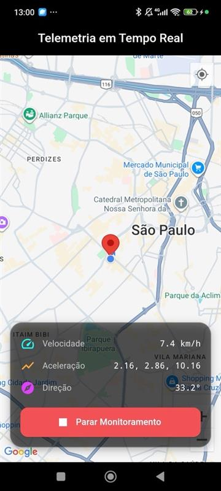
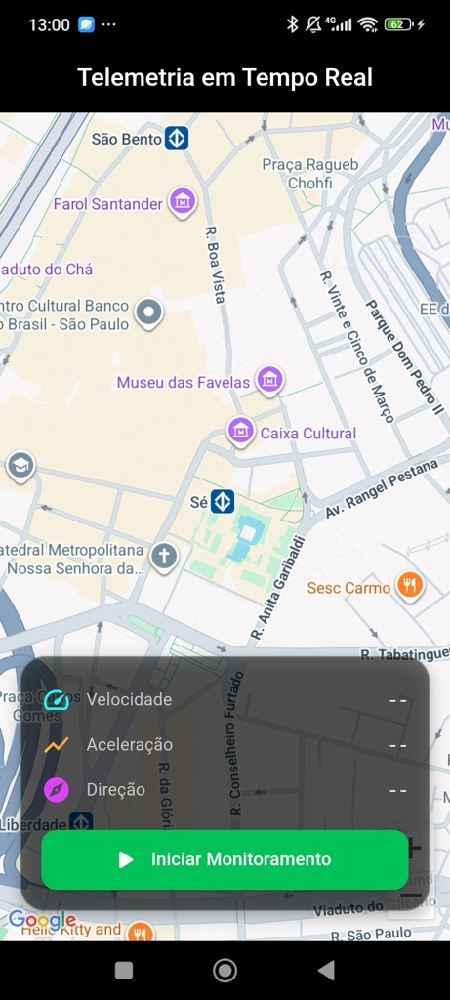

# 📡 Telemetry App

Aplicativo Flutter de **telemetria em tempo real**, que mostra a posição atual do dispositivo no mapa, junto com dados de **velocidade, aceleração e direção (heading)**.  

O app foi desenvolvido para demonstrar a integração entre **sensores físicos do smartphone** e **renderização em mapa**, com atualização contínua dos dados durante o monitoramento.

---

## 🎯 Objetivo do Projeto

O objetivo deste projeto é coletar e exibir dados de telemetria em tempo real, a partir dos sensores de um dispositivo móvel:

- 📍 **Localização (latitude e longitude)**
- 🚗 **Velocidade (via GPS)**
- 📈 **Aceleração (via acelerômetro)**
- 🧭 **Direção / heading (ângulo do deslocamento)**  

Essas informações são exibidas em uma única tela com o mapa centralizado na posição atual do usuário, atualizando automaticamente enquanto o rastreamento estiver ativo.

---

## 🧩 Arquitetura Utilizada

O app segue um modelo baseado em **MVVM (Model–View–ViewModel)** para manter o código desacoplado e escalável:

```
lib/
├── models/
│   └── telemetry_model.dart         → Estrutura dos dados de telemetria
│
├── services/
│   └── telemetry_service.dart       → Captura e stream dos dados (GPS + sensores)
│
├── viewmodels/
│   └── telemetry_viewmodel.dart     → Lógica de controle e integração com Provider
│
├── views/
│   └── telemetry_screen.dart        → Interface com mapa e painel de informações
│
└── main.dart                        → Configuração do app e Provider principal
```

---

## ⚙️ Tecnologias e Pacotes

| Função | Pacote | Versão |
|--------|---------|--------|
| Localização e velocidade | `geolocator` | ^10.1.0 |
| Acelerômetro (sensor) | `sensors_plus` | ^4.0.2 |
| Mapa interativo | `google_maps_flutter` | ^2.3.1 |
| Permissões do dispositivo | `permission_handler` | ^11.0.0 |
| Gerenciamento de estado | `provider` | ^6.1.2 |

---

## 🧠 Como funciona

1. Ao abrir o app, o mapa é exibido centralizado em uma posição padrão (São Paulo).  
2. Ao pressionar **“Iniciar Monitoramento”**, o app:
   - Solicita permissão de localização.
   - Inicia streams de dados do GPS e acelerômetro.
   - Atualiza em tempo real a posição, velocidade e aceleração.
3. O mapa é movimentado automaticamente conforme o usuário se desloca.
4. O botão alterna para **“Parar Monitoramento”**, encerrando as streams.

---

## 🧰 Como executar localmente

### 1️⃣ Clone o repositório
```bash
git clone https://github.com/thayg0r/telemetry.git
cd telemetry
```

### 2️⃣ Instale as dependências
```bash
flutter pub get
```

### 3️⃣ Configure o Google Maps
Crie uma **API Key** no [Google Cloud Console](https://console.cloud.google.com/)  
e adicione no arquivo `android/app/src/main/AndroidManifest.xml`:

```xml
<meta-data
    android:name="com.google.android.geo.API_KEY"
    android:value="SUA_API_KEY_AQUI"/>
```

### 4️⃣ Execute o app
```bash
flutter run
```

---

## 📱 Interface

Aqui estão algumas telas reais do aplicativo em funcionamento:

<p align="center">
  
  
  
</p>

- **Mapa com marcador dinâmico** indicando a posição atual.  
- **Painel inferior** com dados de:
  - Velocidade (km/h)
  - Aceleração (x, y, z)
  - Direção (°)
- **Botão dinâmico** para iniciar/parar o monitoramento.

---

## 📦 Download do Aplicativo

A versão compilada do app já está disponível neste repositório.  
Você pode baixar o arquivo `.apk` diretamente para instalar no seu dispositivo Android:

👉 [Baixar Telemetry APK](./telemetry.apk)

> 💡 *Para instalar, basta transferir o arquivo para o celular e abrir normalmente (é necessário permitir instalações de fontes desconhecidas).*
